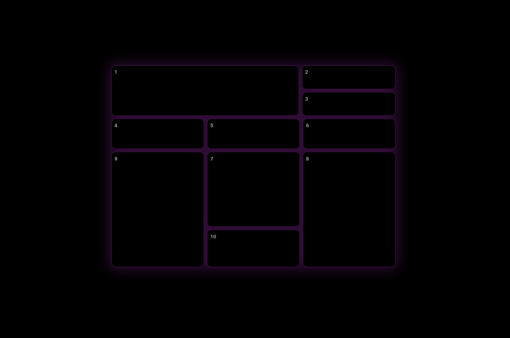

# Flutter_grid

## Features

- Responsive grid layout that adapts to different screen sizes
- Custom glowing effect with purple accent
- Dark theme with subtle borders
- Numbered grid cells with consistent styling
- Flexible and maintainable widget structure

## Customization

You can customize various aspects of the grid:

- Modify the glow effect by adjusting the `BoxShadow` parameters
- Change the grid cell colors and border styles
- Adjust the spacing between cells by modifying the `SizedBox` values
- Customize the cell number styling in the `GridCell` widget

## Contributing

Contributions, issues, and feature requests are welcome!

## Contact

If you have any questions or suggestions, feel free to create an issue in the repository.
